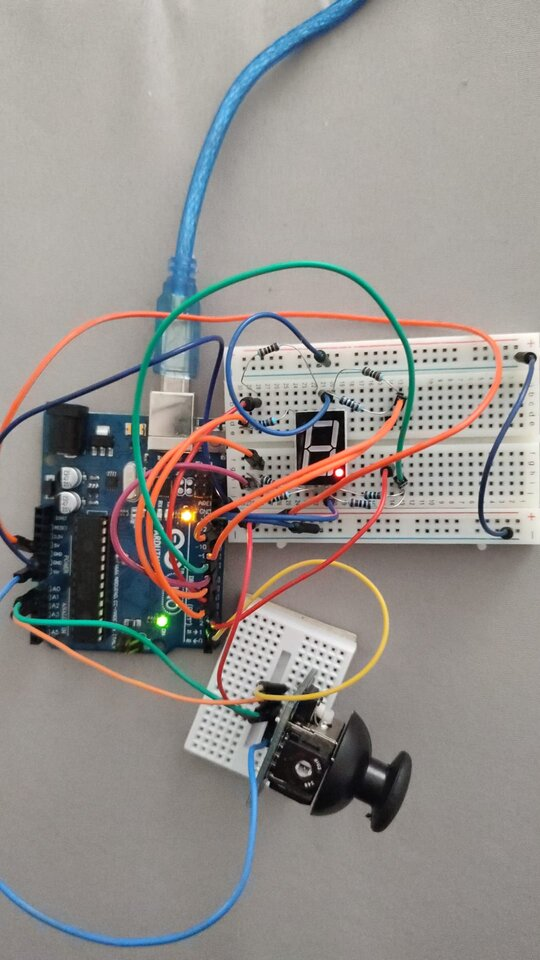

# IntroductionToRobotics

This is my repository that will contain all the assignments from the **"Introduction to Robotics"** laboratory at the **Faculty of Mathematics and Computer Science**, **University of Bucharest**. Each assignment will include detailed documentation, with images and videos.

# Homeworks

<h2> Homework 2

 
This assignment focuses on controlling an RGB LED using three potentiometers (one for each color).

For the implementation, I used:

* An RGB LED
* 3 potentiometers
* 6 resistors of 100 ohms (I connected three in series for each because I only had one 330-ohm resistor)
* 1 resistor of 330 ohms

Photo with first homework:

This is the video with first homework: https://www.youtube.com/watch?v=EDOw4xzkUVw&ab_channel=IulianMarin

<h2> Homework 3

 
This assignment involves simulating a 3-floor elevator control system using
LEDs, buttons, and a buzzer with Arduino.

Components
* LEDs (At least 4: 3 for the floors and 1 for the elevator’s operational
state)
* Buttons
* Buzzer 
* Resistors and wires as needed

This code has functionalities only for the 1st and 3rd floor and has some bugs.The project's functionality is the one shown in the following video.: https://www.youtube.com/shorts/kLPn3MB_2u4

Below is a photo with the assembled homework.

<h2> Homework 4

 
This project involves implementing a 7-segment display using Arduino, where you can 'draw' by lighting up segments one by one.

**General description:** We will use the joystick to control the position of the segment and 'draw' on the display. The movement between segments should be natural, meaning they should transition from the current position only to neighboring segments, without passing through 'walls'.

**Components**:
* 7 segment display (1)
* 1 joystick
* resistors and wires

**Requirement**: The initial position should be on the DP. The current
position always blinks (irrespective of the fact that the segment is on or
off). Use the joystick to move from one position to neighbors (see table for
corresponding movement). Short pressing the button toggles the segment
state from ON to OFF or from OFF to ON. Long pressing the button
resets the entire display by turning all the segments OFF and moving the
current position to the decimal point.

Link with the video: [here](https://youtube.com/shorts/8ki4eayzJKo)

<h2> Homework 5

 
In this project, I created a timer using a 4 digit 7-segment display, 3 buttons (one for start/stop, one for saving laps, and one for reset). To save Arduino pins, I used a 74HC595 shift register.   
 

**General description**: Using the 4 digit 7 segment display and 3 buttons,
we should implement a stopwatch timer that counts in 10ths of a second
and has a save lap functionality (similar to most basic stopwatch functions
on most phones).

The **components** I used are:
* 4-digit 7-segment display
* 3 buttons
* 74HC595 shift register
* Resistors and wires

**Requirement**:  The starting value of the 4 digit 7 segment display should
be ”000.0”. The buttons should have the following functionalities:
* Button 1: Start / pause.
* Button 2: Reset (if in pause mode). Reset saved laps (if in lap
viewing mode).
* Button 3: Save lap (if in counting mode), cycle through last saved
laps (up to 4 laps).

**Workflow**:
1. Display shows ”000.0”. When pressing the Start button, the timer
should start.
2. During timer counter, each time you press the lap button, you should
save that timer’s value in memory (not persistent, it is OK to be
deleted upon reset), up to 4 laps (or more if you want); pressing the
5th time should override the 1st saved one. If you press the reset
button while timer works, nothing happens. If you press the pause
button, the timer stops.
3. In Pause Mode, the lap flag button doesn’t work anymore. Pressing
the reset button resets you to 000.0.
4. After reset, you can now press the flag buttons to cycle through the
lap times. Each time you press the flag button, it takes you to the
next saved lap. Pressing it continuously should cycle you through it
continuously. Pressing the reset button while in this state resets all
your flags and takes the timer back to ”000.0”.

Link with the video: [here](https://www.youtube.com/shorts/0NJ0U_hqhgI)

